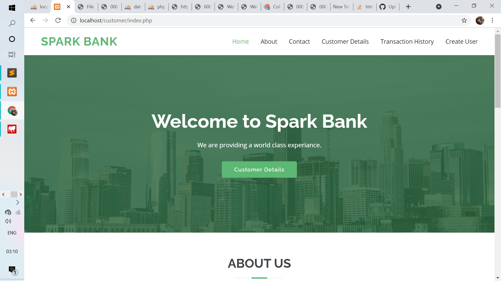

# Banking_website
task 1
# THE SPARKS FOUNDATION 

 Hi I have developed this banking website for <b>The Sparks Foundation</b> Task as Web and Mobile Developer Intern.

<h2 color="green">BANKING WEBSITE </h2>
<li>Task 1:</li>
<li>This is a Basic Banking System.</li>
<li>The project is done using HTML, CSS and a little JS.</li>
<li>A sample database is created with 10 customers.</li>
<li>The home page has the options to transfer moeny and to show transaction history and to create users.</li>
<li>The transaction history shows the details of the transaction made by a customer.</li>

  
  
 I hosted this webswite in 000webhost 
 
 <h3> <b>Website Link:<b><a href="">here<a></h3>
  <h3> <b>Youtube Link:<b><a href="">here<a></h3>
   <h3> <b>Linkedin Post:<b><a href="">here<a></h3> 
   
    
<h3>FOLLOW:</h3>
<li><a href="">LinkedIn</a>
<li><a href="">Instagram</a>
<li><a
href=
"">YouTube</a>
